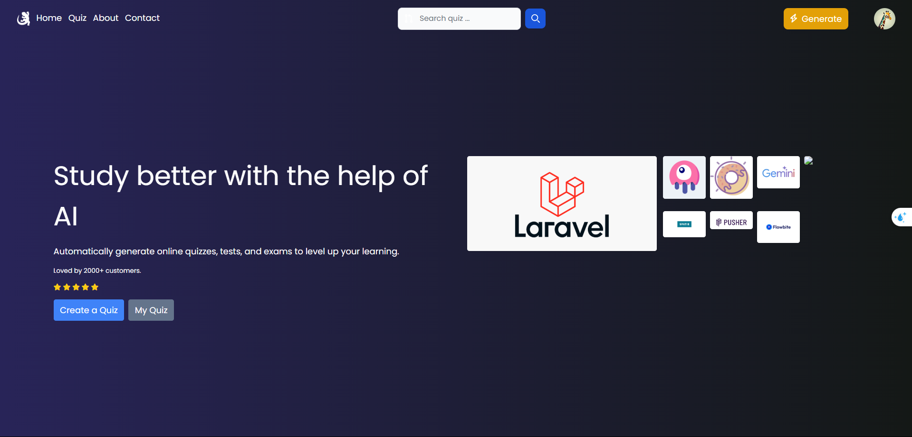

# QuizApp



QuizApp is an application that automatically generates quiz questions using the Gemini AI model. Built with Laravel and Livewire, it allows for easy and fast question creation and management.

## 🚀 Technologies Used
- **Laravel**: A powerful PHP framework for web applications.
- **Livewire**: A library for building dynamic interfaces without needing JavaScript.
- **Gemini AI**: AI model for automatic question generation.
- **MySQL**: Database management system.
- **Docker**: Simplifies application packaging and deployment.

## 📌 Installation
### 1. Clone the Repository
```sh
git clone https://github.com/your-repo/QuizApp.git
cd QuizApp
```

### 2. Configure Environment
Copy `.env.example` to `.env` and update necessary settings:
```sh
cp .env.example .env
```

Update database connection details in `.env`:
```
DB_HOST=quiz-ai-db
DB_PORT=3306
DB_DATABASE=quizai
DB_USERNAME=root
DB_PASSWORD=1234
```

### 3. Start the Application with Docker
```sh
docker-compose up -d --build
```

### 4. Install Dependencies
```sh
docker exec -it quiz-ai-container composer install
docker exec -it quiz-ai-container npm install && npm run build
```

### 5. Run Migrations and Seed Data
```sh
docker exec -it quiz-ai-container php artisan migrate --seed
```

### 6. Access the Application
Open your browser and visit:
```
http://localhost:8000
```

## 🛠️ Key Features
- **Automatically generate questions using Gemini AI**
- **Manage question lists**
- **Play quizzes interactively**
- **Scoring system and result tracking**

## 📝 Contact
If you have any issues or suggestions, feel free to contact via email: `your-email@example.com` or create an issue on GitHub.

---
💡 *Contribute to improve QuizApp!*

